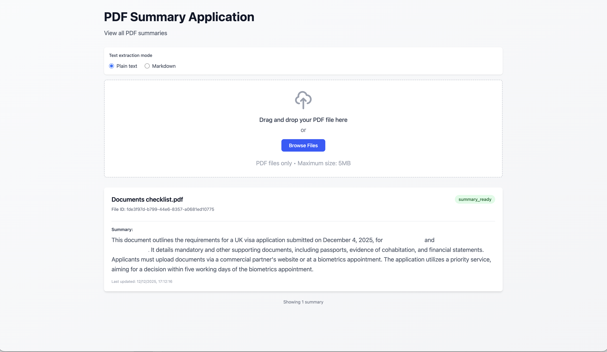

# PDF Summary Application

A full-stack application for PDF summarization built with Next.js frontend and FastAPI backend.



## Architecture

- **Frontend**: Next.js (latest) - React framework
- **Backend**: FastAPI with Python 3.12+ - Main API server
- **Text Extraction Handler**: Python service for extracting text from PDFs using Gemini API
- **Summary Generation Handler**: Python service for generating summaries using Gemini API
- **Redis**: Message queue and caching layer for asynchronous task processing
- **Containerization**: Docker Compose

## Getting Started

### Prerequisites

- Docker
- Docker Compose
- Google API Key (for Gemini API)

### Environment Setup

Before running the application, you need to create a `.env` file in the root directory with the required environment variables:

1. Create a `.env` file in the project root:

```bash
touch .env
```

2. Add the following required environment variable:

```env
GEMINI_API_KEY=your_google_api_key_here
```

**Required Environment Variables:**

- `GEMINI_API_KEY` - Your Google API key for accessing the Gemini API. This is required for both the text extraction (for markdown extraction) and the summary generation. You can obtain an API key from [Google AI Studio](https://makersuite.google.com/app/apikey).

### Running the Application

1. Clone the repository
2. Create and configure the `.env` file as described above
3. Run the entire stack with Docker Compose:

```bash
docker-compose up --build
```

The application will be available at:
- Frontend: http://localhost:3000
- Backend API: http://localhost:8000
- API Documentation: http://localhost:8000/docs

### Development

#### Frontend Development

```bash
cd frontend
npm install
npm run dev
```

#### Backend Development

```bash
cd backend
python -m venv venv
source venv/bin/activate  # On Windows: venv\Scripts\activate
pip install -r requirements.txt
uvicorn main:app --reload --host 0.0.0.0 --port 8000
```

## Project Structure

```
pdf-summary/
├── frontend/                    # Next.js frontend application
├── backend/                     # FastAPI backend application
├── text-extraction-handler/     # Python service for PDF text extraction
├── summary-generation-handler/  # Python service for summary generation
├── docs/                        # Documentation and assets
├── docker-compose.yml           # Docker Compose configuration
└── README.md
```

